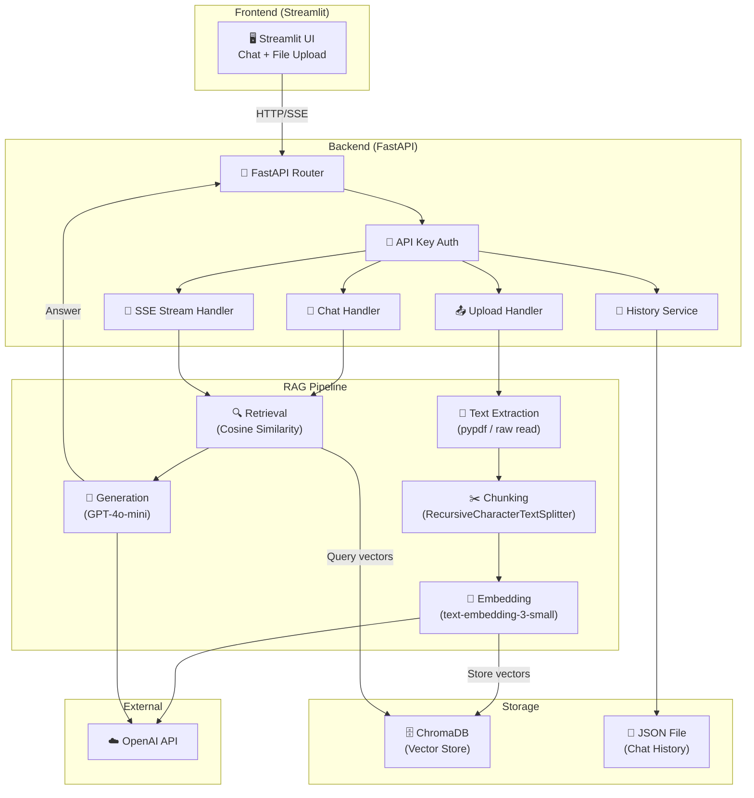
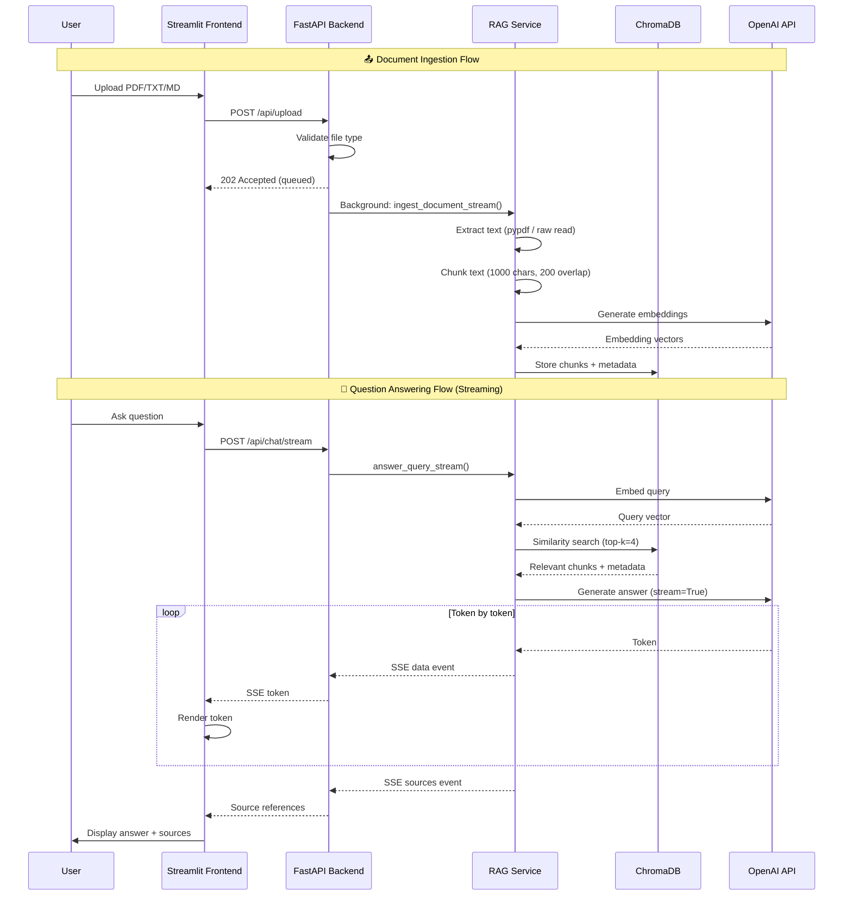

# 🏗️ Architecture

## System Architecture



## RAG Pipeline Flow



## Directory Structure

```
RAG/
├── docker-compose.yml            # Container orchestration
├── ARCHITECTURE.md               # This file
├── README.md                     # Project documentation
├── .gitignore
│
├── backend/
│   ├── Dockerfile
│   ├── .env                      # OPENAI_API_KEY, API_KEY
│   ├── requirements.txt
│   └── app/
│       ├── __init__.py
│       ├── main.py               # FastAPI app + all endpoints
│       ├── core/
│       │   ├── config.py         # Pydantic settings
│       │   └── auth.py           # API key dependency
│       ├── services/
│       │   ├── rag_service.py    # RAG pipeline (ingest + query + stream)
│       │   └── chat_history_service.py  # Session persistence
│       ├── api/
│       │   └── routes/           # (extensible)
│       └── models/               # (extensible)
│
├── frontend/
│   ├── Dockerfile
│   ├── requirements.txt
│   └── app.py                    # Streamlit UI
│
└── data/                         # Git-ignored runtime data
    ├── chroma_db/                # Vector store persistence
    ├── uploads/                  # Temporary file uploads
    └── chat_history.json         # Session history
```

## Technology Stack

| Layer | Technology | Purpose |
|-------|-----------|---------|
| Frontend | Streamlit | Interactive chat UI |
| Backend | FastAPI + Uvicorn | Async REST API |
| LLM | OpenAI GPT-4o-mini | Answer generation |
| Embeddings | text-embedding-3-small | Semantic vector encoding |
| Vector DB | ChromaDB (PersistentClient) | Similarity search |
| Text Extraction | pypdf | PDF parsing |
| Chunking | LangChain RecursiveCharacterTextSplitter | Document segmentation |
| Auth | API Key (X-API-Key header) | Endpoint protection |
| Containerization | Docker + Docker Compose | Deployment |
